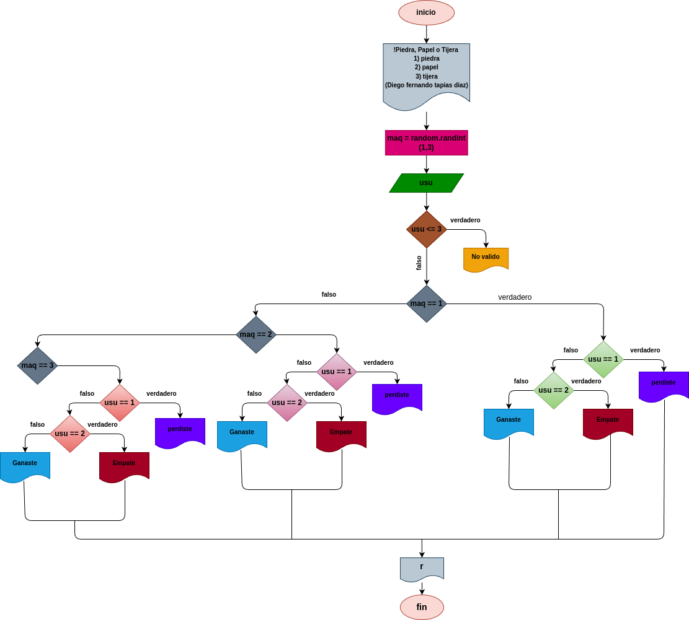

# Piedra_Papel_O_Tijera
Juego dinámico de piedra, papel o tijera contra la computadora

# Analisis

## Input

### Variable de entrada 
usu: eleccion realizadapor el usuario

### Prosesisng

usu: Determna la decision del usuario.

operacioes disponibles:

1) Piedra

2) Papel

3) Tijera

Si usu no es valido, el resultado sera "No valido".

### output
usu: Determina la decision del usuario.

maq: Determine la decision de la maquina.
# Diseño

